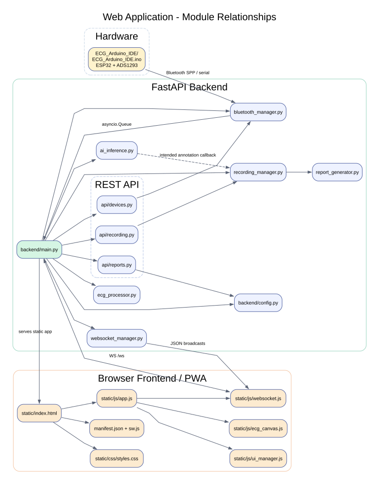
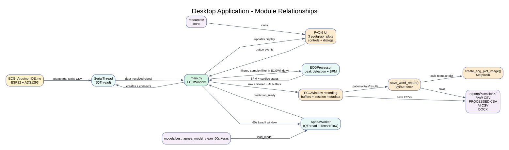
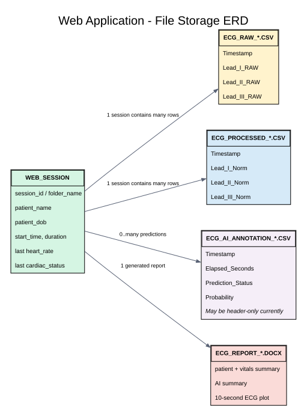
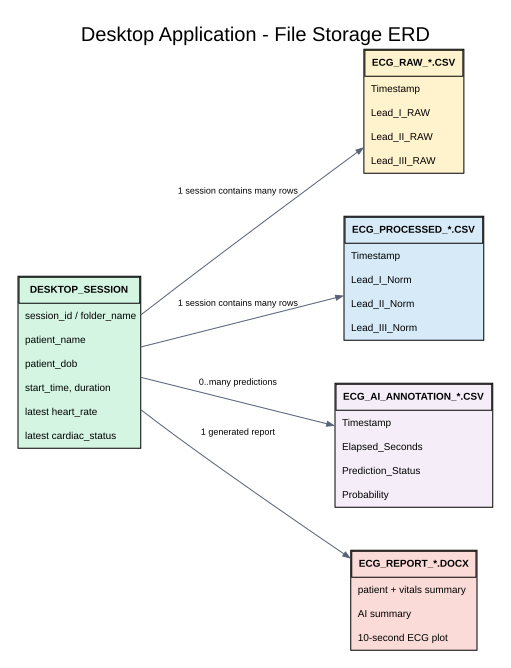

# Wireless ECG AI Monitoring System (GoSipAPP)

## 1. Tentang proyek

Proyek ini memantau sinyal ECG dari **ESP32 + ADS1293** melalui serial Bluetooth Classic (SPP) atau port serial USB. Ada dua aplikasi **alternatif** untuk PC: antarmuka web (FastAPI + browser) dan aplikasi desktop (PyQt6). Keduanya menampilkan tiga kanal sinyal, menghitung detak jantung, menjalankan model deteksi *sleep apnea*, dan menyimpan hasil perekaman secara lokal. Ini prototipe pemantauan, **bukan alat diagnosis klinis yang tervalidasi**.

**Urutan membaca README:** ringkasan alur → teknologi dan kode → instalasi/penggunaan → hasil rekaman dan diagram data.

---

## 2. Cara kerja sistem

### Alur data dari alat ke aplikasi

```text
ESP32 + ADS1293 (100 sampel/detik)
  └─ serial Bluetooth SPP / USB, 115200 baud
      ├─ Web: backend/bluetooth_manager.py → backend/main.py
      │    ├─ filter + estimasi BPM → WebSocket (batch 50 ms) → 3 grafik Canvas di browser
      │    ├─ buffer kanal pertama 60 detik → model TensorFlow → status APNEA/NORMAL
      │    └─ perekaman → CSV + laporan DOCX di reports/
      └─ Desktop: main.py → pemrosesan/prediksi/perekaman serupa → GUI PyQt6
```

**Data dari alat:** Firmware di `ECG_Arduino_IDE/ECG_Arduino_IDE.ino` mengonfigurasi ADS1293 pada 100 Hz dan menamai perangkat Bluetooth **Wireless ECG 1**. Setiap baris berisi `ch1,ch2,ch3\n`; sekitar tiap 5 detik ditambah persentase baterai: `ch1,ch2,ch3,batt\n`. Nama `Lead_I`, `CH1_LA`, dan `CH2_RA` dipakai parser aplikasi; label Lead I/II/III di tampilan mengikuti penamaan proyek, bukan hasil perhitungan lead turunan yang terpisah.

**Pemrosesan ECG dan BPM:** Sinyal tampilan dan estimasi BPM melewati filter Butterworth bandpass **0,5–30 Hz**. BPM dihitung dengan deteksi puncak pada kanal pertama dari buffer hingga 5 detik; statusnya `Normal` (60–100 BPM), `Bradycardia` (<60), `Tachycardia` (>100), `Flat/Noise`, atau `LEAD OFF` bila nilai kanal melampaui ambang 8.000.000.

**Prediksi AI:** Setiap **6.000 sampel / 60 detik** kanal pertama diproses dengan bandpass **0,5–40 Hz** dan normalisasi Z-score, kemudian dikirim ke `models/best_apnea_model_clean_60s.keras`. Probabilitas ≥0,5 ditampilkan sebagai `APNEA`, selain itu `NORMAL`; model `final_apnea_model_clean_60s.keras` tersedia tetapi tidak dipakai secara default.

---

## 3. Teknologi, dependency, dan peta kode

### Teknologi utama

| Bagian | Teknologi / file utama | Tanggung jawab |
| --- | --- | --- |
| Firmware | ESP32, ADS1293, Arduino IDE, `protocentral_ads1293`, `BluetoothSerial`; `ECG_Arduino_IDE/ECG_Arduino_IDE.ino` | Akuisisi tiga kanal, baterai, transmisi serial |
| Web backend | Python, FastAPI, Uvicorn, PySerial; `backend/main.py`, `backend/bluetooth_manager.py` | Membaca port di host, memproses data, REST API dan WebSocket |
| Sinyal dan AI | NumPy, SciPy, TensorFlow/Keras; `backend/ecg_processor.py`, `backend/ai_inference.py`, `models/` | Filter, BPM, inferensi apnea |
| Frontend | HTML, CSS, JavaScript tanpa framework, Canvas, WebSocket, PWA; `backend/static/` | Grafik langsung, kontrol perangkat/rekaman, tampilan status |
| Desktop | PyQt6, pyqtgraph; `main.py` | Alternatif aplikasi lokal, berisi sendiri logika serial, sinyal, AI, dan laporan |
| Laporan | Matplotlib, python-docx; `backend/recording_manager.py`, `backend/report_generator.py` (web), `main.py` (desktop) | CSV data dan dokumen Word |

### Dependency Python dan kegunaannya

Dependency Python dipisahkan karena aplikasi web dan desktop tidak memakai antarmuka yang sama:

| Dependency | Web | Desktop | Kegunaan |
| --- |:---:|:---:|---|
| `fastapi` | ✓ | - | Framework server HTTP dan endpoint REST |
| `uvicorn[standard]` | ✓ | - | Menjalankan aplikasi FastAPI |
| `pyserial` | ✓ | ✓ | Membaca data dari COM port atau Bluetooth serial |
| `numpy` | ✓ | ✓ | Array numerik dan operasi sinyal |
| `scipy` | ✓ | ✓ | Filter Butterworth dan deteksi puncak ECG |
| `tensorflow` | ✓ | ✓ | Memuat model `.keras` dan inferensi Sleep Apnea |
| `python-docx` | ✓ | ✓ | Membuat laporan Word `.docx` |
| `matplotlib` | ✓ | ✓ | Membuat gambar plot ECG untuk laporan |
| `PyQt6` | - | ✓ | Framework GUI aplikasi desktop |
| `pyqtgraph` | - | ✓ | Plot ECG real-time pada desktop |
| `pandas` | - | ✓* | Utilitas data; tercantum di dependency desktop, tetapi tidak menjadi komponen utama alur saat ini |

**File yang dipakai saat instalasi:**

- **Web:** `backend/requirements.txt` — FastAPI, Uvicorn, PySerial, NumPy, SciPy, TensorFlow, Matplotlib, dan python-docx.
- **Desktop:** `requirements.txt` — PyQt6, PyQtGraph, PySerial, NumPy, SciPy, TensorFlow, Matplotlib, python-docx, dan pandas.
- **Firmware:** tidak memakai `pip`. Kompilasi melalui Arduino IDE membutuhkan board package ESP32 dan library `protocentral_ads1293`; `BluetoothSerial` dan `SPI` berasal dari ekosistem ESP32/Arduino.
- **Frontend browser/HP:** tidak memiliki `npm` atau dependency Node.js. Kode menggunakan HTML, CSS, JavaScript native, HTML5 Canvas, WebSocket browser, dan Service Worker bawaan browser.

Instal dependency sesuai aplikasi yang ingin dijalankan. Untuk web, tidak perlu memasang PyQt6 atau pyqtgraph; untuk desktop, tidak perlu menjalankan FastAPI/Uvicorn. TensorFlow adalah dependency paling berat dan paling sensitif terhadap versi Python/OS, sehingga gunakan Python 3.10–3.11 sesuai panduan proyek dan siapkan instalasi CPU/GPU yang sesuai mesin penerima.

### Peta kode web (termasuk tampilan di HP)

HP hanya **klien browser**: pengambilan data Bluetooth/serial, filter, AI, dan penyimpanan berjalan di laptop/PC yang menjalankan server. Ikuti alur ini saat membaca kode:

| Mulai dari | Gunanya → mengarah ke |
| --- | --- |
| `backend/static/index.html` + `css/styles.css` | Halaman, tiga kanvas ECG, tombol, modal pasien, dan tata letak responsif HP; memuat skrip `js/*.js`. |
| `backend/static/js/app.js` | Menghubungkan klik tombol dan pesan masuk: **Refresh** → `GET /api/ports`; **Connect/Record/Pause** → perintah WebSocket dari `websocket.js`; data masuk → `ecg_canvas.js` (grafik) atau `ui_manager.js` (status/BPM/baterai). |
| `backend/static/js/websocket.js` | Membuka `ws(s)://<host>/ws`, mengirim perintah JSON, menerima pesan seperti `ecg`, `hr`, `ai`, `recording`, dan tersambung ulang jika koneksi putus. |
| `backend/main.py` | Titik masuk FastAPI: melayani halaman dan `/ws`, menerima perintah; loop `process_ecg_data()` mengambil data dari `bluetooth_manager.py` → `ecg_processor.py` (filter/BPM), `ai_inference.py` (prediksi), `recording_manager.py` (rekam). Loop lain menyiarkan status tiap 1 detik dan sampel ECG tiap 50 ms melalui `websocket_manager.py`. |
| `backend/api/devices.py`, `recording.py`, `reports.py` | REST untuk daftar port, kendali/status rekaman, daftar serta unduh laporan. Frontend saat ini memakai REST untuk daftar port, tetapi kendali rekaman melalui WebSocket. |
| `backend/recording_manager.py` → `report_generator.py` | Saat stop rekam: simpan CSV mentah/terproses/anotasi dan buat DOCX di `reports/`. Konstanta/path web di `backend/config.py`; model AI di `models/`. |
| `backend/static/manifest.json` + `sw.js` | Metadata instalasi PWA dan cache file antarmuka; **bukan** pemrosesan ECG offline. |

**Contoh alur tombol Connect:** `app.js` memanggil `ws.connectDevice(port)` → `websocket.js` mengirim `{type: 'connect', port}` → `/ws` di `backend/main.py` memanggil `BluetoothManager.connect()` → data perangkat dibaca dan diteruskan ke browser sebagai pesan `ecg`.

**Contoh alur tombol Stop Recording:** `/ws` memanggil `RecordingManager.stop_recording()` → `report_generator.py` membuat laporan → browser menerima `report_saved` dan menampilkan lokasinya.

### Diagram hubungan modul (kode)

#### A. Hubungan modul web

Firmware mengirim data ke backend; FastAPI mengoordinasi pemrosesan, API, WebSocket, dan frontend browser. Garis putus-putus AI → perekaman menandai callback anotasi yang **belum terhubung**, bukan alur yang sudah berjalan.



#### B. Hubungan modul desktop

Seluruh kelas pemrosesan, serial, antarmuka, dan pembuat laporan berada dalam satu `main.py`. Diagram memecahnya menjadi komponen logis agar mudah diikuti; aplikasi desktop **tidak mengimpor backend**.



---

## 4. Panduan instalasi dan penggunaan

Langkah berikut dijalankan dari **folder akar proyek** (`WirelessECG/`). Perangkat Bluetooth/port serial harus tersedia **di laptop yang menjalankan aplikasi**, bukan di HP.

### Langkah 1 — Siapkan ESP32 (sekali saat awal)

1. Pasang **Arduino IDE**, lalu melalui *Boards Manager* pasang paket board **esp32 by Espressif Systems**. Pilih board ESP32 yang sesuai dengan perangkat dan port USB-nya.
2. Pasang library **Protocentral ADS1293** yang menyediakan header `protocentral_ads1293.h` (melalui *Library Manager* jika tersedia, atau dari paket library Protocentral). `BluetoothSerial.h` dan `SPI.h` berasal dari lingkungan ESP32/Arduino.
3. Hubungkan modul ADS1293 sesuai firmware: `DRDY=GPIO 2`, `CS=GPIO 5`, `SCK=18`, `MISO=19`, `MOSI=23`; pengukuran baterai menggunakan `GPIO 34` melalui pembagi tegangan. Periksa kesesuaian rangkaian dan catu daya sebelum menyalakan perangkat.
4. Buka `ECG_Arduino_IDE/ECG_Arduino_IDE.ino`, klik **Verify**, lalu **Upload** ke ESP32. Setelah menyala, nama Bluetooth yang diiklankan adalah **Wireless ECG 1**. Firmware mengirim CSV ECG melalui **Bluetooth**, sedangkan Serial Monitor USB mengeluarkan teks debug berlabel, bukan format CSV yang dibaca aplikasi.

### Langkah 2 — Instal Python dan dependency di laptop

Pasang **Python 3.11** (rekomendasi proyek) dan pastikan perintah `python --version` tersedia. Di Windows, pilih opsi menambahkan Python ke PATH saat instalasi. Perintah di bawah ditujukan untuk **PowerShell Windows**; pilih **web atau desktop**, tidak harus keduanya.

**A. Buat dan aktifkan lingkungan Python (untuk web maupun desktop)**

```powershell
python -m venv .venv
.\.venv\Scripts\Activate.ps1
python -m pip install --upgrade pip
```

**B. Instal untuk web (browser laptop/HP)**

```powershell
python -m pip install -r backend/requirements.txt
```

**Atau, instal untuk desktop (aplikasi PyQt6)**

```powershell
python -m pip install -r requirements.txt
```

**Jika memakai Linux/macOS:** aktifkan lingkungan dengan `source .venv/bin/activate`. Jika PowerShell menolak skrip aktivasi, gunakan CMD dengan `.venv\Scripts\activate.bat` atau panggil `.venv\Scripts\python.exe` langsung untuk perintah Python. Instalasi TensorFlow cukup besar; bila gagal, cek kompatibilitas versi Python/OS dan pesan error dari `pip`.

### Langkah 3 — Jalankan aplikasi pilihanmu

**A. Web — dibuka di browser laptop**

```powershell
python -m uvicorn backend.main:app --host 127.0.0.1 --port 8000
```

Buka <http://localhost:8000> di laptop yang menjalankan server.

**B. Web — dibuka juga melalui HP dalam satu Wi-Fi**

```powershell
python -m uvicorn backend.main:app --host 0.0.0.0 --port 8000
```

Di Windows, jalankan `ipconfig` di terminal lain dan temukan **IPv4 Address** adaptor Wi-Fi laptop. Buka `http://<IP-LAN-laptop>:8000` di browser HP, misalnya `http://192.168.1.10:8000`. Jika tidak terbuka, cek apakah HP dan laptop memakai Wi-Fi yang sama serta apakah firewall Windows mengizinkan Python/port 8000 di jaringan privat.

> **Penting untuk HP:** `localhost` di HP mengacu ke HP sendiri. HP hanya menampilkan/mengendalikan aplikasi; ESP32 tetap dipasangkan ke laptop. Halaman bisa dibuka melalui HTTP LAN, tetapi instalasi PWA/service worker pada HP umumnya membutuhkan HTTPS. Jangan mengekspos server ke internet: aplikasi belum memiliki autentikasi.

**C. Desktop — aplikasi PyQt6, bukan lewat browser**

```powershell
python main.py
```

Jalankan web dan desktop **secara terpisah** jika menggunakan COM port yang sama; satu port tidak dapat dibuka keduanya bersamaan.

### Langkah 4 — Sambungkan alat dan rekam ECG

1. Di Windows, pasangkan **Wireless ECG 1** lewat *Settings → Bluetooth & devices*, lalu lihat port COM Bluetooth di *Device Manager → Ports (COM & LPT)*. Di Linux, mungkin perlu izin grup `dialout` dan binding ke `/dev/rfcomm*`.
2. Di web atau desktop, klik **Refresh → pilih port serial laptop → Connect**. Pastikan grafik bergerak dan indikator serial SPS bertambah. Jangan membuka port yang sama di web dan desktop bersamaan.
3. Klik **Recording Time**, isi nama serta tanggal lahir, lalu klik **Mulai Rekam**. Tunggu sedikitnya 60 detik jika ingin melihat prediksi AI pertama (tergantung sampel yang masuk).
4. Klik **Stop Recording & Save Report**. Hasil berada di `reports/<Nama>_<timestamp>/`: buka `.docx` untuk ringkasan dan plot, `.csv` RAW untuk sampel asli, PROCESSED untuk data ternormalisasi, dan AI ANNOTATION untuk riwayat prediksi bila tersedia. Di web, lokasi folder ditampilkan dalam pesan; daftar/unduh laporan juga tersedia lewat `/api/reports` dan endpoint download (belum ada halaman daftar laporan di UI).

### Jika ada masalah

| Gejala | Yang perlu diperiksa |
| --- | --- |
| Port tidak muncul / gagal Connect | Daya ESP32, pairing Bluetooth, driver, **Refresh**, nomor COM, atau port sedang dipakai aplikasi lain. |
| Grafik kosong | Pemasangan sensor dan keluaran CSV melalui Bluetooth. Serial Monitor USB firmware berisi teks debug, bukan CSV aplikasi. |
| HP tidak bisa membuka web | IP Wi-Fi laptop, `--host 0.0.0.0`, jaringan yang sama, dan firewall. |
| AI belum tampil | Tunggu 6.000 sampel (sekitar 60 detik pada 100 Hz); cek log server dan model di `models/`. |

**Catatan tombol Pause:** saat ini pemrosesan sampel juga berhenti selama jeda, bukan sekadar grafik yang dibekukan.

### Referensi endpoint web (untuk pengembang)

REST: `GET /api/ports`, `GET /api/status`, `POST /api/recording/start`, `POST /api/recording/stop`, `GET /api/recording/status`, `GET /api/reports`, dan `GET /api/reports/{session_id}/download/{filename}`. Kontrol langsung dan data berkala menggunakan `WS /ws`.

---

## 5. Hasil rekaman dan catatan serah-terima

Tidak ada database. Saat rekaman dihentikan, aplikasi membuat `reports/<Nama>_<YYYYMMDD_HHMMSS>/` berisi:

### A. ERD penyimpanan web



### B. ERD penyimpanan desktop



**Cara membaca ERD:** Kedua ERD adalah **model konseptual relasi file**, bukan tabel SQL: satu folder sesi berisi masing-masing satu file RAW, PROCESSED, ANNOTATION dan DOCX. Angka `many rows` berarti banyak baris dalam CSV, bukan banyak file. Metadata sesi disimpan pada nama folder dan sebagian dalam DOCX; **tidak ada tabel atau file metadata sesi tersendiri**. Di web CSV anotasi dapat hanya berisi header karena callback pencatatan AI belum dipasang; di desktop hasil prediksi yang terjadi saat merekam masuk ke CSV anotasi.

### Isi file keluaran

| File | Isi |
| --- | --- |
| `ECG_RAW_*.csv` | Timestamp dan tiga angka kanal mentah dari perangkat |
| `ECG_PROCESSED_*.csv` | Tiga kanal hasil filter, dinormalisasi Z-score per sesi |
| `ECG_AI_ANNOTATION_*.csv` | Timestamp, detik sejak mulai, status dan probabilitas AI (bila tercatat) |
| `ECG_REPORT_*.docx` | Identitas pasien, status jantung, ringkasan AI, jumlah sampel, serta plot segmen hingga 10 detik |

### Hal yang perlu diketahui penerima proyek

- Di jalur **web**, `AIInference.on_prediction` belum dihubungkan ke `RecordingManager.add_ai_result`; status AI dapat tampil, tetapi CSV anotasi dan ringkasan AI laporan web bisa kosong. Desktop sudah mencatat hasil AI saat sedang merekam.
- `RecordingManager.stop_recording()` mengosongkan waktu mulai sebelum membuat laporan; akibatnya durasi sesi di laporan web saat ini menjadi `00:00:00`. Label **Avg Heart Rate** pada laporan sebenarnya memakai BPM terakhir, bukan rata-rata sesi.
- Web menyimpan state port/rekaman secara global tanpa autentikasi; beberapa browser memakai perangkat dan sesi yang sama. Data pasien disimpan lokal dalam file, sehingga akses server dan folder `reports/` perlu dibatasi. Belum ada rangkaian tes otomatis atau data simulasi perangkat di repositori.
- Firmware mencetak data debug ke Serial USB dengan format berlabel (`CH1: ...`), sedangkan data CSV yang dibaca aplikasi dikirim lewat Bluetooth. Bila memakai USB langsung, diperlukan format CSV yang sesuai parser aplikasi.

### Memperbarui diagram (opsional)

Sumber empat diagram ada di `resources/diagrams/*.dot` dan hasil gambarnya `.svg` di folder yang sama. **Pembaca tidak perlu Graphviz** untuk melihat gambar di README. Jika ingin mengedit diagram, pasang Graphviz lalu render ulang, misalnya:

```bash
dot -Tsvg resources/diagrams/web_storage_erd.dot -o resources/diagrams/web_storage_erd.svg
```

Ulangi untuk tiga file `.dot` lain. Diagram lama di `resources/relations_diagram.png`, `dfd_diagram.png`, dan `erd_diagram.png` adalah artefak dokumentasi awal, bukan acuan empat diagram baru ini.
