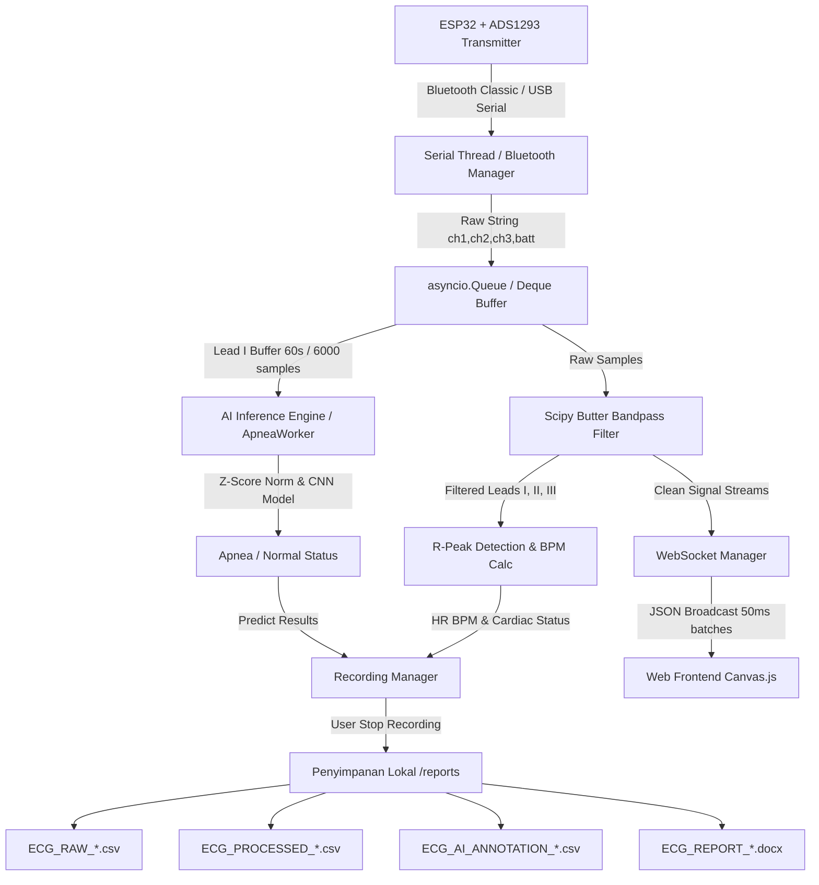
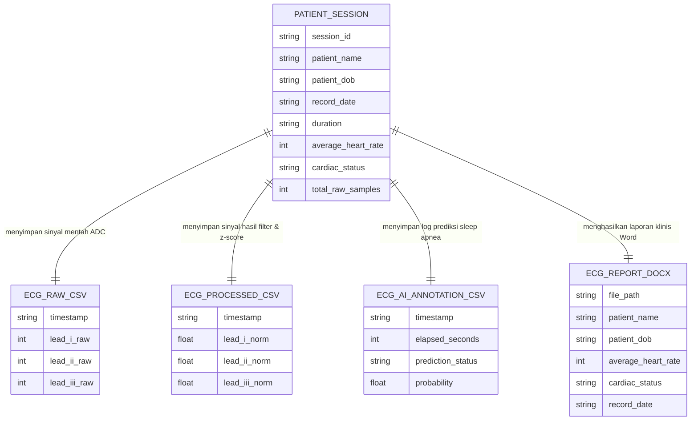

# Dokumentasi Teknis & Panduan Penggunaan: Wireless ECG AI Monitoring System

Dokumentasi ini dibuat untuk mempermudah tim proyek memahami arsitektur, hubungan antar komponen kode, dan petunjuk operasional sistem pemantauan Elektrokardiogram (ECG) nirkabel berbasis Kecerdasan Buatan (Deep Learning - CNN) untuk deteksi Sleep Apnea.

---

## 🌟 Ringkasan Sistem

Sistem ini dirancang dengan arsitektur sebagai berikut:
1. **Perangkat Keras Pemancar (Otak Sensor: ESP32):** Menggunakan ESP32 + ADS1293 (atau modul AD8232/CJMCU) untuk menyadap sinyal ECG 3-lead secara real-time dan mentransmisikannya secara nirkabel melalui Bluetooth Classic (Serial Port Profile - SPP).
2. **Aplikasi Server Web (FastAPI + WebSockets + HTML5 Canvas):** Menggunakan Python FastAPI sebagai server backend yang menangani penerimaan data serial Bluetooth, pemrosesan sinyal digital (DSP), inferensi model AI (TensorFlow), dan penyiaran data ke klien web browser melalui WebSockets. Visualisasi di web digambar menggunakan HTML5 Canvas berkecepatan tinggi.
3. **Aplikasi Desktop (PyQt6):** Aplikasi alternatif berbasis desktop untuk pemantauan, analisis, dan perekaman data ECG lokal langsung di PC/Laptop.

---

## 📊 Diagram Aliran Data (Data Flow Diagram)

Berikut adalah diagram alir bagaimana data sinyal ECG dibaca dari perangkat keras hingga divisualisasikan pada layar pengguna dan disimpan ke penyimpanan lokal:


<details>
<summary>💻 Lihat Source Code Mermaid (Klik untuk Ekspand)</summary>


</details>

---

## 🔗 Hubungan Antar Modul (Relationship Graph)

Berikut adalah grafik hubungan dan dependensi antar file kode sumber Python dan Frontend di dalam direktori proyek ini (terkecuali file `.md` dan `.pdf`):

```mermaid
flowchart TD
    subgraph Desktop["Aplikasi Desktop (PyQt6)"]
        main["main.py"]
    end

    subgraph Web["Aplikasi Web (FastAPI + Websockets)"]
        web_main["backend/main.py"]
        web_config["backend/config.py"]
        web_bt["backend/bluetooth_manager.py"]
        web_proc["backend/ecg_processor.py"]
        web_ai["backend/ai_inference.py"]
        web_rec["backend/recording_manager.py"]
        web_rep["backend/report_generator.py"]
        web_ws["backend/websocket_manager.py"]
        
        subgraph API["REST API Routes"]
            api_dev["backend/api/devices.py"]
            api_rec["backend/api/recording.py"]
            api_rep["backend/api/reports.py"]
        end
        
        subgraph Frontend["Frontend (Static HTML/JS/CSS)"]
            fe_index["backend/static/index.html"]
            fe_app["backend/static/js/app.js"]
            fe_ws["backend/static/js/websocket.js"]
            fe_ui["backend/static/js/ui_manager.js"]
            fe_canvas["backend/static/js/ecg_canvas.js"]
            fe_style["backend/static/css/styles.css"]
        end
    end

    subgraph Hardware["Hardware Transmitter"]
        esp["ECG_Arduino_IDE/ECG_Arduino_IDE.ino <br> ESP32 + ADS1293"]
    end

    %% Dependencies
    main --> web_rep
    main --> web_config
    
    web_main --> web_config
    web_main --> web_bt
    web_main --> web_proc
    web_main --> web_ai
    web_main --> web_rec
    web_main --> web_ws
    web_main --> api_dev
    web_main --> api_rec
    web_main --> api_rep
    web_main --> fe_index
    
    api_dev --> web_bt
    api_rec --> web_rec
    api_rep --> web_config
    
    web_rec --> web_rep
    web_rep --> web_config
    
    esp -.->|Transmisi Data Bluetooth SPP| web_bt
    esp -.->|Transmisi Data Bluetooth SPP| main
```


<details>
<summary>💻 Lihat Source Code Mermaid (Klik untuk Ekspand)</summary>


</details>

---

## 🗄️ Relasi Penyimpanan Data (File Persistence "ERD")

Karena proyek ini tidak menggunakan basis data relasional (SQL) melainkan menyimpan data riwayat sesi ke dalam berkas flat-file (`.csv` dan `.docx`) di direktori `reports/` demi kecepatan portabilitas data medis, maka relasi entitas penyimpanannya terstruktur sebagai berikut:


<details>
<summary>💻 Lihat Source Code Mermaid (Klik untuk Ekspand)</summary>


</details>

### 📋 Deskripsi Struktur Field

#### 1. Sesi Pasien (Patient Session Metadata)
* `session_id`: ID unik folder sesi perekaman. Format: `[NamaPasien]_[Timestamp]`.
* `patient_name`: Nama lengkap pasien (diinput sebelum perekaman).
* `patient_dob`: Tanggal lahir pasien (DD/MM/YYYY).
* `record_date`: Waktu dimulainya perekaman.
* `duration`: Durasi sesi perekaman (Format: HH:MM:SS).
* `average_heart_rate`: Nilai BPM rata-rata yang terhitung selama sesi berlangsung.
* `cardiac_status`: Diagnosis irama jantung terakhir (Normal, Bradycardia, Tachycardia, Flat/Noise, Lead Off).
* `total_raw_samples`: Jumlah data baris sinyal yang tercatat.

#### 2. Log Data CSV & Laporan Word
* **ECG_RAW_CSV:** Berisi stempel waktu dan data mentah ADC langsung dari sensor (Lead I, Lead II, Lead III).
* **ECG_PROCESSED_CSV:** Berisi sinyal EKG yang telah difilter digital (bandpass 0.5 - 30 Hz) serta dinormalisasi menggunakan Z-Score Scaling untuk visualisasi klinis.
* **ECG_AI_ANNOTATION_CSV:** Menyimpan log hasil deteksi Sleep Apnea otomatis dari model CNN TensorFlow per 60 detik (Interval Update AI).
* **ECG_REPORT_DOCX:** Berkas dokumen Word formal laporan rekam medis pasien yang secara otomatis menyisipkan tabel vitals dan plot grafik visualisasi sinyal 10 detik.

---

## 🛠️ Prasyarat Sistem & Dependensi

Proyek ini dijalankan pada komputer host (PC / Laptop dengan OS Windows, macOS, atau Linux) yang terhubung ke modul pengirim ESP32 via Bluetooth.

1. **Python 3.10 atau Python 3.11** (Sangat disarankan menggunakan Python 3.11.0).
   > [!WARNING]
   > Hindari penggunaan Python 3.12 ke atas karena library `tensorflow` (mesin komputasi AI) belum mendukung versi tersebut secara stabil di beberapa sistem.
2. **Koneksi Bluetooth** pada komputer host (dongle USB Bluetooth atau bawaan laptop) untuk menerima data nirkabel dari ESP32.

---

## 🚀 Petunjuk Menjalankan Aplikasi Web (FastAPI)

Versi web server ini memiliki antarmuka yang sangat responsif, memiliki fitur dark/light mode otomatis, plot EKG modern berbasis HTML5 Canvas, dan performa real-time berkat teknologi WebSockets.

### Langkah 1: Kloning & Persiapan Direktori
Buka terminal/CMD di komputer Anda dan arahkan ke direktori proyek ini:
```bash
cd "C:\project\Wireless ECG source code"
```

### Langkah 2: Membuat & Mengaktifkan Virtual Environment
Sangat disarankan membuat virtual environment agar pustaka python proyek ini tidak bentrok dengan pustaka global Anda.

* **Windows (PowerShell/CMD):**
  ```powershell
  python -m venv venv
  .\venv\Scripts\activate
  ```
* **macOS / Linux:**
  ```bash
  python3 -m venv venv
  source venv/bin/activate
  ```

### Langkah 3: Menginstal Dependensi Web Backend
Jalankan instalasi modul-modul python yang tertera pada `backend/requirements.txt`:
```bash
pip install -r backend/requirements.txt
```

> [!NOTE]
> Jika Anda mengalami error kompilasi saat menginstal `tensorflow`, pastikan pip Anda sudah dalam versi terbaru dengan perintah `pip install --upgrade pip` atau Anda bisa menginstal tensorflow versi CPU saja (`pip install tensorflow-cpu`) jika spesifikasi perangkat keras terbatas.

### Langkah 4: Menjalankan Server FastAPI
Server web ini dapat dihidupkan menggunakan program **Uvicorn** dari direktori utama proyek:
```bash
uvicorn backend.main:app --host 127.0.0.1 --port 8000 --reload
```

Penjelasan argumen perintah:
* `backend.main:app` : Mengacu pada objek aplikasi FastAPI (`app`) di dalam `backend/main.py`.
* `--host 127.0.0.1` : Menyediakan server di alamat lokal. (Gunakan `--host 0.0.0.0` jika ingin bisa diakses dari perangkat lain dalam satu jaringan Wi-Fi).
* `--port 8000` : Berjalan di port 8000.
* `--reload` : Mengaktifkan fitur reload otomatis jika Anda melakukan perubahan pada kode backend.

### Langkah 5: Mengakses Antarmuka Web
Setelah server berhasil berjalan dengan pesan `Application startup complete.`, buka web browser (Chrome, Edge, Firefox, atau Safari) and navigasikan ke alamat:
👉 **[http://localhost:8000](http://localhost:8000)**

---

## 💻 Petunjuk Menjalankan Aplikasi Desktop (PyQt6)

Sebagai alternatif, Anda juga dapat menjalankan aplikasi GUI desktop berbasis PyQt6 bawaan proyek ini:

1. Pastikan Anda berada dalam virtual environment yang aktif.
2. Instal dependensi desktop:
   ```bash
   pip install -r requirements.txt
   ```
3. Jalankan aplikasi:
   * **Windows:**
     ```bash
     python main.py
     ```
   * **Linux/macOS:**
     ```bash
     python3 main.py
     ```

---

## 🔌 Konfigurasi Hardware & Penggunaan Serial

### 1. Format Protokol Data Sinyal (ESP32)
Firmware ESP32 (`ECG_Arduino_IDE.ino`) mengirimkan data berkala melalui koneksi Serial Bluetooth dengan format string CSV baris demi baris:
* **Format Normal (Tiap siklus sampel EKG - 100 Hz):**
  `[Lead_I],[CH1_LA],[CH2_RA]\r\n`
  *Contoh:* `1824,1980,1720\n`
* **Format dengan Data Baterai (Dikirim 5 detik sekali):**
  `[Lead_I],[CH1_LA],[CH2_RA],[BATT_PERCENT]\r\n`
  *Contoh:* `1824,1980,1720,98\n`

### 2. Cara Menyambungkan Bluetooth (Windows)
1. Nyalakan ESP32 yang terhubung dengan modul ADS1293.
2. Di Windows, buka menu **Settings > Bluetooth & devices > Add device**.
3. Hubungkan ke perangkat bernama **"Wireless ECG 1"**.
4. Buka **Device Manager > Ports (COM & LPT)** untuk melihat nomor COM Port yang terasosiasi dengan koneksi Bluetooth tersebut (misal: `COM9`).
5. Pada antarmuka Web atau Desktop, klik tombol **Refresh**, pilih COM Port tersebut dari dropdown, dan klik **Connect**.

### 3. Izin Tambahan untuk Pengguna Linux
Jika Anda menjalankan web server di OS berbasis Linux, port Bluetooth serial seringkali membutuhkan hak akses superuser.
* Berikan izin akses serial ke user Anda:
  ```bash
  sudo usermod -a -G dialout $USER
  ```
  *(Lakukan reboot/logout setelah menjalankan perintah ini)*
* Bind port Bluetooth manual sebelum dijalankan:
  ```bash
  sudo rfcomm bind 0 [MAC_ADDRESS_ESP32]
  ```
  Alat akan terdeteksi di web server sebagai `/dev/rfcomm0`.
