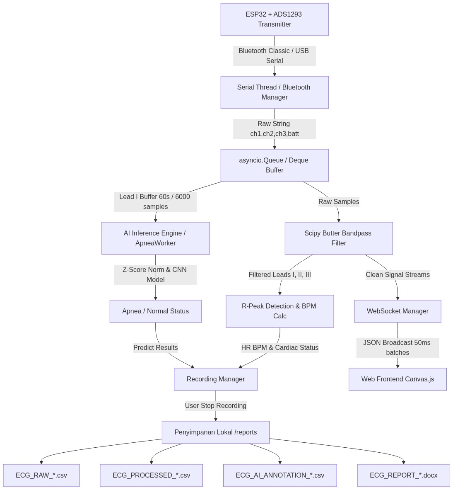
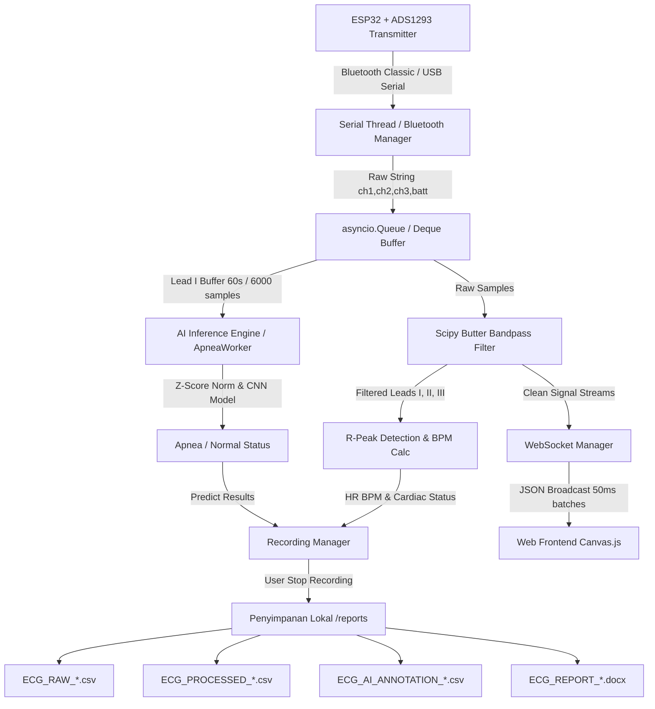
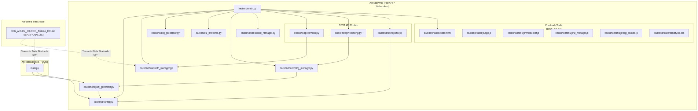
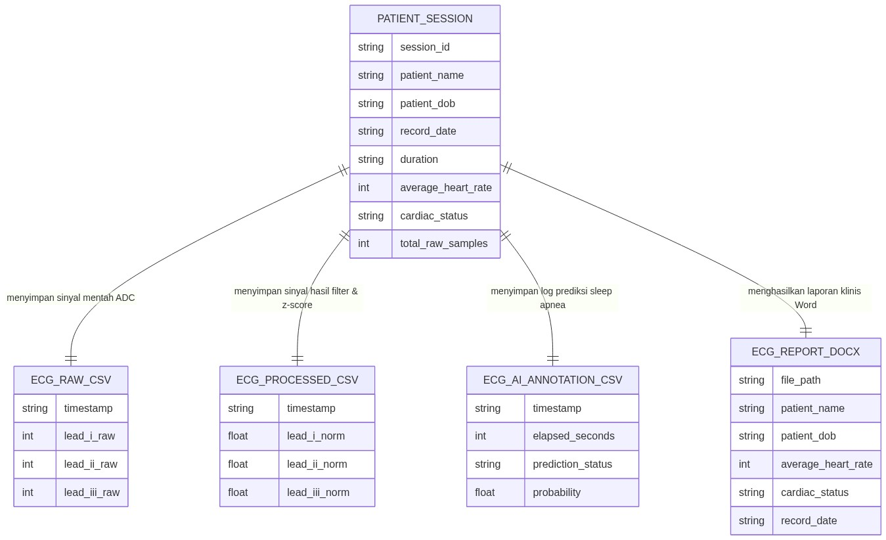
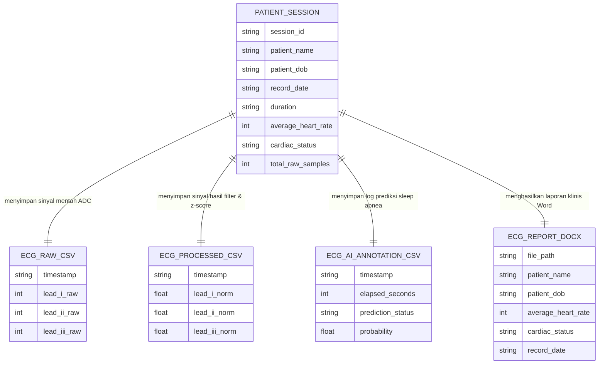

# Panduan Ringkas: Wireless ECG AI Monitoring System

Sistem pemantauan EKG nirkabel (3-lead) berbasis ESP32 dengan deteksi Sleep Apnea otomatis menggunakan AI (TensorFlow).

---

## 📐 Arsitektur & Data Flow

Data sinyal disadap oleh **ESP32 + ADS1293**, dikirim via **Bluetooth SPP** ke **FastAPI Server (Web)** atau **PyQt6 (Desktop)**, kemudian diproses (filter & AI) dan divisualisasikan.



<details>
<summary>💻 Source Code Mermaid (DFD)</summary>


</details>

---

## 🔗 Hubungan Modul (Dependencies)

Relasi antar file kode Python (backend & desktop) dan Frontend (HTML/JS/CSS):

```mermaid
flowchart TD
    subgraph Desktop["Aplikasi Desktop (PyQt6)"]
        main["main.py"]
    end
    subgraph Web["Aplikasi Web (FastAPI + Websockets)"]
        web_main["backend/main.py"]
        web_config["backend/config.py"]
        web_bt["backend/bluetooth_manager.py"]
        web_proc["backend/ecg_processor.py"]
        web_ai["backend/ai_inference.py"]
        web_rec["backend/recording_manager.py"]
        web_rep["backend/report_generator.py"]
        web_ws["backend/websocket_manager.py"]
        subgraph API["REST API Routes"]
            api_dev["backend/api/devices.py"]
            api_rec["backend/api/recording.py"]
            api_rep["backend/api/reports.py"]
        end
        subgraph Frontend["Frontend (Static HTML/JS/CSS)"]
            fe_index["backend/static/index.html"]
            fe_app["backend/static/js/app.js"]
            fe_ws["backend/static/js/websocket.js"]
            fe_ui["backend/static/js/ui_manager.js"]
            fe_canvas["backend/static/js/ecg_canvas.js"]
            fe_style["backend/static/css/styles.css"]
        end
    end
    subgraph Hardware["Hardware Transmitter"]
        esp["ECG_Arduino_IDE/ECG_Arduino_IDE.ino <br> ESP32 + ADS1293"]
    end
    main --> web_rep
    main --> web_config
    web_main --> web_config
    web_main --> web_bt
    web_main --> web_proc
    web_main --> web_ai
    web_main --> web_rec
    web_main --> web_ws
    web_main --> api_dev
    web_main --> api_rec
    web_main --> api_rep
    web_main --> fe_index
    api_dev --> web_bt
    api_rec --> web_rec
    api_rep --> web_config
    web_rec --> web_rep
    web_rep --> web_config
    esp -.->|Transmisi Data Bluetooth SPP| web_bt
    esp -.->|Transmisi Data Bluetooth SPP| main
```



<details>
<summary>💻 Source Code Mermaid (Modul)</summary>


</details>

---

## 🗄️ ERD Penyimpanan File Log (CSV & Word)

Skema flat-file penyimpanan lokal pada folder `reports/`:



<details>
<summary>💻 Source Code Mermaid (ERD)</summary>


</details>

---

## ⚡ Quick Start (Cara Menjalankan)

### 1. Prasyarat
* **Python 3.10 - 3.11** (Jangan gunakan 3.12+ demi kompatibilitas TensorFlow).
* Modul ESP32 transmitter menyala & terhubung Bluetooth PC.

### 2. Setup Awal (Terminal/CMD)
```bash
# Arahkan ke folder proyek
cd "C:\project\Wireless ECG source code"

# Buat virtual environment & aktivasi
python -m venv venv
venv\Scripts\activate      # Windows
source venv/bin/activate   # macOS/Linux

# Install dependensi
pip install -r backend/requirements.txt
```

### 3. Jalankan Aplikasi Web (FastAPI)
```bash
uvicorn backend.main:app --host 127.0.0.1 --port 8000 --reload
```
Akses web UI pada browser: 👉 **[http://localhost:8000](http://localhost:8000)**

### 4. Jalankan Aplikasi Desktop (PyQt6)
```bash
pip install -r requirements.txt
python main.py
```

---

## 🔌 Protokol Data ESP32
Koneksi Serial Bluetooth berjalan pada **baudrate 115200**. Format string CSV yang dikirimkan:
* **EKG (100 Hz):** `[Lead_I],[CH1_LA],[CH2_RA]\n`
* **EKG + Baterai (Tiap 5 detik):** `[Lead_I],[CH1_LA],[CH2_RA],[BATT_PERCENT]\n`
